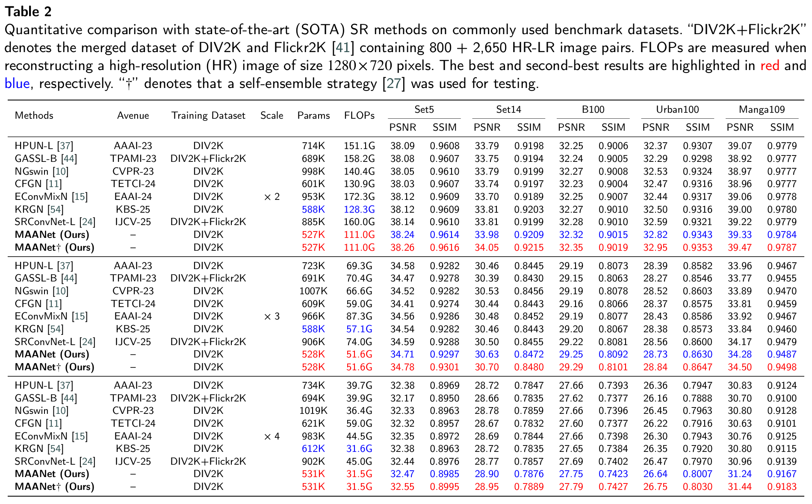

# 📖 MAANet: A Lightweight Multi-Axis Adaptation Network for Efficient Image Super-Resolution

## :hammer: Requirements and Installation
> - Python 3.9, PyTorch >= 2.0
> - BasicSR 1.4.2
> - Platforms: Ubuntu, CUDA 12

### Installation
```bash
# Clone the repo
git clone https://github.com/chrimy666999/MAANet.git
# Install dependent packages
cd MAANet
pip install -r requirements.txt
# Install BasicSR
python setup.py develop
```

## :rocket: Training and Testing 
### Data Preparation
Please download the datasets and place them in the `./datasets` folder.
**Directory Structure:**
```text
datasets
├── DIV2K
└── benchmark
    ├── Set5
    ├── Set14
    ├── B100
    ├── Urban100
    └── Manga109
```
### Download Links:
| Dataset | Download Link | Password | Note |
| :---: | :---: | :---: | :---: |
| **Training (DIV2K)** | [Baidu Disk](https://pan.baidu.com/s/1d9bxtbGJcZpcp2xRpYTHmg) | `maan` | For Training |
| **benchmark** | [Baidu Disk](https://pan.baidu.com/s/1SAQIEvNbWUziyNwZ0qj8tQ) | `maan` | Set5, Set14, B100, Urban100, Manga109 |

- Note: It is recommended to convert images to LMDB format for faster IO speed. Please refer to the [BasicSR Data Preparation](https://github.com/chrimy666999/MAANet/blob/main/docs/DatasetPreparation.md) guide for details.

### Training
Run the following commands for training:
```bash
python basicsr/train.py -opt options/train/train_DIV2K_X2.yml
python basicsr/train.py -opt options/train/train_DIV2K_X3.yml
python basicsr/train.py -opt options/train/train_DIV2K_X4.yml
```
### Testing
Run the following commands for testing:
```bash
python basicsr/test.py -opt options/test/test_benchmark_X2.yml
python basicsr/test.py -opt options/test/test_benchmark_X3.yml
python basicsr/test.py -opt options/test/test_benchmark_X4.yml
```
- The test results will be in './results'.

## :bar_chart: Efficient SR Results
<p align="center">  </p>

## 🥰 Acknowledgement
This code is based on [BasicSR](https://github.com/XPixelGroup/BasicSR) toolbox. Thanks for the awesome work.

